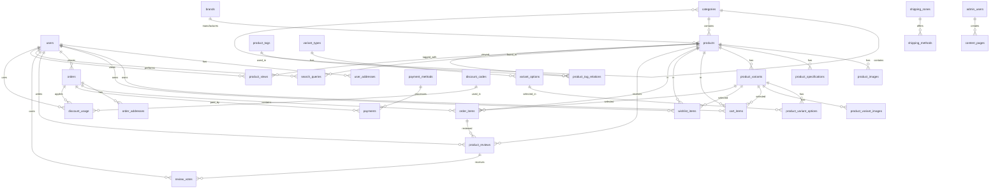

# Elecxo E-commerce Database Schema Design

## Overview

This document outlines a comprehensive database schema for the Elecxo e-commerce platform, designed to support all current features and provide scalability for future enhancements. The schema is designed for a relational database (PostgreSQL/MySQL) with proper normalization, indexing, and referential integrity.

## Database Tables

### 1. User Management

#### `users`

| Field              | Type                            | Constraints      | Description                 |
| ------------------ | ------------------------------- | ---------------- | --------------------------- |
| id                 | UUID                            | PRIMARY KEY      | Unique user identifier      |
| email              | VARCHAR(255)                    | UNIQUE, NOT NULL | User email address          |
| password_hash      | VARCHAR(255)                    | NOT NULL         | Hashed password             |
| first_name         | VARCHAR(100)                    | NOT NULL         | User's first name           |
| last_name          | VARCHAR(100)                    | NOT NULL         | User's last name            |
| phone              | VARCHAR(20)                     | NULL             | Phone number                |
| date_of_birth      | DATE                            | NULL             | Date of birth               |
| gender             | ENUM('male', 'female', 'other') | NULL             | Gender                      |
| avatar_url         | VARCHAR(500)                    | NULL             | Profile picture URL         |
| email_verified     | BOOLEAN                         | DEFAULT FALSE    | Email verification status   |
| is_active          | BOOLEAN                         | DEFAULT TRUE     | Account status              |
| preferred_language | VARCHAR(5)                      | DEFAULT 'en'     | Language preference (en/km) |
| created_at         | TIMESTAMP                       | DEFAULT NOW()    | Account creation time       |
| updated_at         | TIMESTAMP                       | DEFAULT NOW()    | Last update time            |

#### `user_addresses`

| Field          | Type                                | Constraints            | Description          |
| -------------- | ----------------------------------- | ---------------------- | -------------------- |
| id             | UUID                                | PRIMARY KEY            | Address identifier   |
| user_id        | UUID                                | FOREIGN KEY (users.id) | User reference       |
| type           | ENUM('shipping', 'billing', 'both') | NOT NULL               | Address type         |
| is_default     | BOOLEAN                             | DEFAULT FALSE          | Default address flag |
| first_name     | VARCHAR(100)                        | NOT NULL               | Recipient first name |
| last_name      | VARCHAR(100)                        | NOT NULL               | Recipient last name  |
| company        | VARCHAR(100)                        | NULL                   | Company name         |
| address_line_1 | VARCHAR(255)                        | NOT NULL               | Primary address      |
| address_line_2 | VARCHAR(255)                        | NULL                   | Secondary address    |
| city           | VARCHAR(100)                        | NOT NULL               | City                 |
| state          | VARCHAR(100)                        | NOT NULL               | State/Province       |
| postal_code    | VARCHAR(20)                         | NOT NULL               | ZIP/Postal code      |
| country        | VARCHAR(100)                        | NOT NULL               | Country              |
| phone          | VARCHAR(20)                         | NULL                   | Contact phone        |
| created_at     | TIMESTAMP                           | DEFAULT NOW()          | Creation time        |
| updated_at     | TIMESTAMP                           | DEFAULT NOW()          | Last update time     |

### 2. Product Management

#### `categories`

| Field            | Type         | Constraints                 | Description          |
| ---------------- | ------------ | --------------------------- | -------------------- |
| id               | UUID         | PRIMARY KEY                 | Category identifier  |
| name             | VARCHAR(100) | NOT NULL                    | Category name        |
| slug             | VARCHAR(100) | UNIQUE, NOT NULL            | URL-friendly name    |
| description      | TEXT         | NULL                        | Category description |
| image_url        | VARCHAR(500) | NULL                        | Category image       |
| icon             | VARCHAR(100) | NULL                        | Icon identifier      |
| parent_id        | UUID         | FOREIGN KEY (categories.id) | Parent category      |
| sort_order       | INTEGER      | DEFAULT 0                   | Display order        |
| is_active        | BOOLEAN      | DEFAULT TRUE                | Active status        |
| meta_title       | VARCHAR(255) | NULL                        | SEO title            |
| meta_description | TEXT         | NULL                        | SEO description      |
| created_at       | TIMESTAMP    | DEFAULT NOW()               | Creation time        |
| updated_at       | TIMESTAMP    | DEFAULT NOW()               | Last update time     |

#### `brands`

| Field       | Type         | Constraints      | Description       |
| ----------- | ------------ | ---------------- | ----------------- |
| id          | UUID         | PRIMARY KEY      | Brand identifier  |
| name        | VARCHAR(100) | UNIQUE, NOT NULL | Brand name        |
| slug        | VARCHAR(100) | UNIQUE, NOT NULL | URL-friendly name |
| description | TEXT         | NULL             | Brand description |
| logo_url    | VARCHAR(500) | NULL             | Brand logo        |
| website_url | VARCHAR(500) | NULL             | Brand website     |
| is_active   | BOOLEAN      | DEFAULT TRUE     | Active status     |
| created_at  | TIMESTAMP    | DEFAULT NOW()    | Creation time     |
| updated_at  | TIMESTAMP    | DEFAULT NOW()    | Last update time  |

#### `products`

| Field               | Type          | Constraints                 | Description                        |
| ------------------- | ------------- | --------------------------- | ---------------------------------- |
| id                  | UUID          | PRIMARY KEY                 | Product identifier                 |
| name                | VARCHAR(255)  | NOT NULL                    | Product name                       |
| slug                | VARCHAR(255)  | UNIQUE, NOT NULL            | URL-friendly name                  |
| description         | TEXT          | NOT NULL                    | Product description                |
| short_description   | VARCHAR(500)  | NULL                        | Brief description                  |
| sku                 | VARCHAR(100)  | UNIQUE, NOT NULL            | Stock keeping unit                 |
| category_id         | UUID          | FOREIGN KEY (categories.id) | Category reference                 |
| brand_id            | UUID          | FOREIGN KEY (brands.id)     | Brand reference                    |
| base_price          | DECIMAL(10,2) | NOT NULL                    | Base price                         |
| compare_price       | DECIMAL(10,2) | NULL                        | Original/compare price             |
| cost_price          | DECIMAL(10,2) | NULL                        | Cost price                         |
| weight              | DECIMAL(8,3)  | NULL                        | Product weight (kg)                |
| dimensions          | JSON          | NULL                        | Dimensions (length, width, height) |
| is_active           | BOOLEAN       | DEFAULT TRUE                | Active status                      |
| is_featured         | BOOLEAN       | DEFAULT FALSE               | Featured product                   |
| is_bestseller       | BOOLEAN       | DEFAULT FALSE               | Bestseller flag                    |
| is_new              | BOOLEAN       | DEFAULT FALSE               | New product flag                   |
| track_inventory     | BOOLEAN       | DEFAULT TRUE                | Inventory tracking                 |
| stock_quantity      | INTEGER       | DEFAULT 0                   | Current stock                      |
| low_stock_threshold | INTEGER       | DEFAULT 5                   | Low stock alert                    |
| meta_title          | VARCHAR(255)  | NULL                        | SEO title                          |
| meta_description    | TEXT          | NULL                        | SEO description                    |
| created_at          | TIMESTAMP     | DEFAULT NOW()               | Creation time                      |
| updated_at          | TIMESTAMP     | DEFAULT NOW()               | Last update time                   |

#### `product_images`

| Field      | Type         | Constraints               | Description                |
| ---------- | ------------ | ------------------------- | -------------------------- |
| id         | UUID         | PRIMARY KEY               | Image identifier           |
| product_id | UUID         | FOREIGN KEY (products.id) | Product reference          |
| image_url  | VARCHAR(500) | NOT NULL                  | Image URL                  |
| alt_text   | VARCHAR(255) | NULL                      | Alt text for accessibility |
| sort_order | INTEGER      | DEFAULT 0                 | Display order              |
| is_primary | BOOLEAN      | DEFAULT FALSE             | Primary image flag         |
| created_at | TIMESTAMP    | DEFAULT NOW()             | Creation time              |

#### `product_specifications`

| Field      | Type         | Constraints               | Description              |
| ---------- | ------------ | ------------------------- | ------------------------ |
| id         | UUID         | PRIMARY KEY               | Specification identifier |
| product_id | UUID         | FOREIGN KEY (products.id) | Product reference        |
| name       | VARCHAR(100) | NOT NULL                  | Specification name       |
| value      | TEXT         | NOT NULL                  | Specification value      |
| sort_order | INTEGER      | DEFAULT 0                 | Display order            |
| created_at | TIMESTAMP    | DEFAULT NOW()             | Creation time            |

#### `product_tags`

| Field      | Type        | Constraints      | Description       |
| ---------- | ----------- | ---------------- | ----------------- |
| id         | UUID        | PRIMARY KEY      | Tag identifier    |
| name       | VARCHAR(50) | UNIQUE, NOT NULL | Tag name          |
| slug       | VARCHAR(50) | UNIQUE, NOT NULL | URL-friendly name |
| created_at | TIMESTAMP   | DEFAULT NOW()    | Creation time     |

#### `product_tag_relations`

| Field      | Type      | Constraints                   | Description       |
| ---------- | --------- | ----------------------------- | ----------------- |
| product_id | UUID      | FOREIGN KEY (products.id)     | Product reference |
| tag_id     | UUID      | FOREIGN KEY (product_tags.id) | Tag reference     |
| created_at | TIMESTAMP | DEFAULT NOW()                 | Creation time     |

**Primary Key**: (product_id, tag_id)

### 3. Product Variants

#### `variant_types`

| Field        | Type         | Constraints      | Description                   |
| ------------ | ------------ | ---------------- | ----------------------------- |
| id           | UUID         | PRIMARY KEY      | Variant type identifier       |
| name         | VARCHAR(50)  | UNIQUE, NOT NULL | Type name (color, size, etc.) |
| display_name | VARCHAR(100) | NOT NULL         | Display name                  |
| sort_order   | INTEGER      | DEFAULT 0        | Display order                 |
| created_at   | TIMESTAMP    | DEFAULT NOW()    | Creation time                 |

#### `variant_options`

| Field           | Type         | Constraints                    | Description            |
| --------------- | ------------ | ------------------------------ | ---------------------- |
| id              | UUID         | PRIMARY KEY                    | Option identifier      |
| variant_type_id | UUID         | FOREIGN KEY (variant_types.id) | Variant type reference |
| name            | VARCHAR(100) | NOT NULL                       | Option name            |
| display_name    | VARCHAR(100) | NOT NULL                       | Display name           |
| color_code      | VARCHAR(7)   | NULL                           | Color hex code         |
| sort_order      | INTEGER      | DEFAULT 0                      | Display order          |
| created_at      | TIMESTAMP    | DEFAULT NOW()                  | Creation time          |

#### `product_variants`

| Field          | Type          | Constraints               | Description        |
| -------------- | ------------- | ------------------------- | ------------------ |
| id             | UUID          | PRIMARY KEY               | Variant identifier |
| product_id     | UUID          | FOREIGN KEY (products.id) | Product reference  |
| sku            | VARCHAR(100)  | UNIQUE, NOT NULL          | Variant SKU        |
| price_modifier | DECIMAL(10,2) | DEFAULT 0                 | Price difference   |
| stock_quantity | INTEGER       | DEFAULT 0                 | Variant stock      |
| weight         | DECIMAL(8,3)  | NULL                      | Variant weight     |
| is_active      | BOOLEAN       | DEFAULT TRUE              | Active status      |
| created_at     | TIMESTAMP     | DEFAULT NOW()             | Creation time      |
| updated_at     | TIMESTAMP     | DEFAULT NOW()             | Last update time   |

#### `product_variant_options`

| Field      | Type      | Constraints                       | Description       |
| ---------- | --------- | --------------------------------- | ----------------- |
| variant_id | UUID      | FOREIGN KEY (product_variants.id) | Variant reference |
| option_id  | UUID      | FOREIGN KEY (variant_options.id)  | Option reference  |
| created_at | TIMESTAMP | DEFAULT NOW()                     | Creation time     |

**Primary Key**: (variant_id, option_id)

#### `product_variant_images`

| Field      | Type         | Constraints                       | Description       |
| ---------- | ------------ | --------------------------------- | ----------------- |
| id         | UUID         | PRIMARY KEY                       | Image identifier  |
| variant_id | UUID         | FOREIGN KEY (product_variants.id) | Variant reference |
| image_url  | VARCHAR(500) | NOT NULL                          | Image URL         |
| alt_text   | VARCHAR(255) | NULL                              | Alt text          |
| sort_order | INTEGER      | DEFAULT 0                         | Display order     |
| created_at | TIMESTAMP    | DEFAULT NOW()                     | Creation time     |

### 4. Shopping Cart & Wishlist

#### `cart_items`

| Field      | Type          | Constraints                       | Description                  |
| ---------- | ------------- | --------------------------------- | ---------------------------- |
| id         | UUID          | PRIMARY KEY                       | Cart item identifier         |
| user_id    | UUID          | FOREIGN KEY (users.id)            | User reference               |
| product_id | UUID          | FOREIGN KEY (products.id)         | Product reference            |
| variant_id | UUID          | FOREIGN KEY (product_variants.id) | Variant reference (optional) |
| quantity   | INTEGER       | NOT NULL, CHECK (quantity > 0)    | Item quantity                |
| unit_price | DECIMAL(10,2) | NOT NULL                          | Price at time of adding      |
| created_at | TIMESTAMP     | DEFAULT NOW()                     | Creation time                |
| updated_at | TIMESTAMP     | DEFAULT NOW()                     | Last update time             |

#### `wishlist_items`

| Field      | Type      | Constraints                       | Description                  |
| ---------- | --------- | --------------------------------- | ---------------------------- |
| id         | UUID      | PRIMARY KEY                       | Wishlist item identifier     |
| user_id    | UUID      | FOREIGN KEY (users.id)            | User reference               |
| product_id | UUID      | FOREIGN KEY (products.id)         | Product reference            |
| variant_id | UUID      | FOREIGN KEY (product_variants.id) | Variant reference (optional) |
| created_at | TIMESTAMP | DEFAULT NOW()                     | Creation time                |

### 5. Order Management

#### `orders`

| Field           | Type                                                                                        | Constraints            | Description                 |
| --------------- | ------------------------------------------------------------------------------------------- | ---------------------- | --------------------------- |
| id              | UUID                                                                                        | PRIMARY KEY            | Order identifier            |
| order_number    | VARCHAR(50)                                                                                 | UNIQUE, NOT NULL       | Human-readable order number |
| user_id         | UUID                                                                                        | FOREIGN KEY (users.id) | Customer reference          |
| status          | ENUM('pending', 'confirmed', 'processing', 'shipped', 'delivered', 'cancelled', 'refunded') | DEFAULT 'pending'      | Order status                |
| currency        | VARCHAR(3)                                                                                  | DEFAULT 'USD'          | Currency code               |
| subtotal        | DECIMAL(10,2)                                                                               | NOT NULL               | Items subtotal              |
| discount_amount | DECIMAL(10,2)                                                                               | DEFAULT 0              | Total discount              |
| shipping_amount | DECIMAL(10,2)                                                                               | DEFAULT 0              | Shipping cost               |
| tax_amount      | DECIMAL(10,2)                                                                               | DEFAULT 0              | Tax amount                  |
| total_amount    | DECIMAL(10,2)                                                                               | NOT NULL               | Final total                 |
| payment_status  | ENUM('pending', 'paid', 'failed', 'refunded', 'partially_refunded')                         | DEFAULT 'pending'      | Payment status              |
| shipping_method | VARCHAR(100)                                                                                | NULL                   | Shipping method             |
| tracking_number | VARCHAR(100)                                                                                | NULL                   | Shipping tracking number    |
| notes           | TEXT                                                                                        | NULL                   | Order notes                 |
| shipped_at      | TIMESTAMP                                                                                   | NULL                   | Shipping date               |
| delivered_at    | TIMESTAMP                                                                                   | NULL                   | Delivery date               |
| created_at      | TIMESTAMP                                                                                   | DEFAULT NOW()          | Order creation time         |
| updated_at      | TIMESTAMP                                                                                   | DEFAULT NOW()          | Last update time            |

#### `order_addresses`

| Field          | Type                        | Constraints             | Description          |
| -------------- | --------------------------- | ----------------------- | -------------------- |
| id             | UUID                        | PRIMARY KEY             | Address identifier   |
| order_id       | UUID                        | FOREIGN KEY (orders.id) | Order reference      |
| type           | ENUM('shipping', 'billing') | NOT NULL                | Address type         |
| first_name     | VARCHAR(100)                | NOT NULL                | Recipient first name |
| last_name      | VARCHAR(100)                | NOT NULL                | Recipient last name  |
| company        | VARCHAR(100)                | NULL                    | Company name         |
| address_line_1 | VARCHAR(255)                | NOT NULL                | Primary address      |
| address_line_2 | VARCHAR(255)                | NULL                    | Secondary address    |
| city           | VARCHAR(100)                | NOT NULL                | City                 |
| state          | VARCHAR(100)                | NOT NULL                | State/Province       |
| postal_code    | VARCHAR(20)                 | NOT NULL                | ZIP/Postal code      |
| country        | VARCHAR(100)                | NOT NULL                | Country              |
| phone          | VARCHAR(20)                 | NULL                    | Contact phone        |
| created_at     | TIMESTAMP                   | DEFAULT NOW()           | Creation time        |

#### `order_items`

| Field           | Type          | Constraints                       | Description                   |
| --------------- | ------------- | --------------------------------- | ----------------------------- |
| id              | UUID          | PRIMARY KEY                       | Order item identifier         |
| order_id        | UUID          | FOREIGN KEY (orders.id)           | Order reference               |
| product_id      | UUID          | FOREIGN KEY (products.id)         | Product reference             |
| variant_id      | UUID          | FOREIGN KEY (product_variants.id) | Variant reference (optional)  |
| product_name    | VARCHAR(255)  | NOT NULL                          | Product name at time of order |
| product_sku     | VARCHAR(100)  | NOT NULL                          | Product SKU at time of order  |
| variant_options | JSON          | NULL                              | Variant options selected      |
| quantity        | INTEGER       | NOT NULL, CHECK (quantity > 0)    | Item quantity                 |
| unit_price      | DECIMAL(10,2) | NOT NULL                          | Unit price at time of order   |
| total_price     | DECIMAL(10,2) | NOT NULL                          | Total price for this item     |
| created_at      | TIMESTAMP     | DEFAULT NOW()                     | Creation time                 |

### 6. Payment Management

#### `payment_methods`

| Field         | Type                                                                    | Constraints      | Description               |
| ------------- | ----------------------------------------------------------------------- | ---------------- | ------------------------- |
| id            | UUID                                                                    | PRIMARY KEY      | Payment method identifier |
| name          | VARCHAR(100)                                                            | UNIQUE, NOT NULL | Method name               |
| display_name  | VARCHAR(100)                                                            | NOT NULL         | Display name              |
| type          | ENUM('credit_card', 'debit_card', 'aba_pay', 'paypal', 'bank_transfer') | NOT NULL         | Payment type              |
| is_active     | BOOLEAN                                                                 | DEFAULT TRUE     | Active status             |
| sort_order    | INTEGER                                                                 | DEFAULT 0        | Display order             |
| configuration | JSON                                                                    | NULL             | Method-specific config    |
| created_at    | TIMESTAMP                                                               | DEFAULT NOW()    | Creation time             |

#### `payments`

| Field             | Type                                                                          | Constraints                      | Description              |
| ----------------- | ----------------------------------------------------------------------------- | -------------------------------- | ------------------------ |
| id                | UUID                                                                          | PRIMARY KEY                      | Payment identifier       |
| order_id          | UUID                                                                          | FOREIGN KEY (orders.id)          | Order reference          |
| payment_method_id | UUID                                                                          | FOREIGN KEY (payment_methods.id) | Payment method reference |
| transaction_id    | VARCHAR(255)                                                                  | NULL                             | External transaction ID  |
| amount            | DECIMAL(10,2)                                                                 | NOT NULL                         | Payment amount           |
| currency          | VARCHAR(3)                                                                    | DEFAULT 'USD'                    | Currency code            |
| status            | ENUM('pending', 'processing', 'completed', 'failed', 'cancelled', 'refunded') | DEFAULT 'pending'                | Payment status           |
| gateway_response  | JSON                                                                          | NULL                             | Gateway response data    |
| processed_at      | TIMESTAMP                                                                     | NULL                             | Processing timestamp     |
| created_at        | TIMESTAMP                                                                     | DEFAULT NOW()                    | Creation time            |
| updated_at        | TIMESTAMP                                                                     | DEFAULT NOW()                    | Last update time         |

### 7. Discount & Promotion Management

#### `discount_codes`

| Field                | Type                                                | Constraints      | Description              |
| -------------------- | --------------------------------------------------- | ---------------- | ------------------------ |
| id                   | UUID                                                | PRIMARY KEY      | Discount code identifier |
| code                 | VARCHAR(50)                                         | UNIQUE, NOT NULL | Discount code            |
| name                 | VARCHAR(100)                                        | NOT NULL         | Discount name            |
| description          | TEXT                                                | NULL             | Description              |
| type                 | ENUM('percentage', 'fixed_amount', 'free_shipping') | NOT NULL         | Discount type            |
| value                | DECIMAL(10,2)                                       | NOT NULL         | Discount value           |
| minimum_amount       | DECIMAL(10,2)                                       | NULL             | Minimum order amount     |
| maximum_discount     | DECIMAL(10,2)                                       | NULL             | Maximum discount amount  |
| usage_limit          | INTEGER                                             | NULL             | Total usage limit        |
| usage_limit_per_user | INTEGER                                             | NULL             | Per-user usage limit     |
| used_count           | INTEGER                                             | DEFAULT 0        | Times used               |
| is_active            | BOOLEAN                                             | DEFAULT TRUE     | Active status            |
| starts_at            | TIMESTAMP                                           | NULL             | Start date               |
| expires_at           | TIMESTAMP                                           | NULL             | Expiry date              |
| created_at           | TIMESTAMP                                           | DEFAULT NOW()    | Creation time            |
| updated_at           | TIMESTAMP                                           | DEFAULT NOW()    | Last update time         |

#### `discount_usage`

| Field            | Type          | Constraints                     | Description             |
| ---------------- | ------------- | ------------------------------- | ----------------------- |
| id               | UUID          | PRIMARY KEY                     | Usage identifier        |
| discount_code_id | UUID          | FOREIGN KEY (discount_codes.id) | Discount code reference |
| user_id          | UUID          | FOREIGN KEY (users.id)          | User reference          |
| order_id         | UUID          | FOREIGN KEY (orders.id)         | Order reference         |
| discount_amount  | DECIMAL(10,2) | NOT NULL                        | Applied discount amount |
| created_at       | TIMESTAMP     | DEFAULT NOW()                   | Usage time              |

### 8. Review & Rating System

#### `product_reviews`

| Field                | Type         | Constraints                                   | Description            |
| -------------------- | ------------ | --------------------------------------------- | ---------------------- |
| id                   | UUID         | PRIMARY KEY                                   | Review identifier      |
| product_id           | UUID         | FOREIGN KEY (products.id)                     | Product reference      |
| user_id              | UUID         | FOREIGN KEY (users.id)                        | User reference         |
| order_item_id        | UUID         | FOREIGN KEY (order_items.id)                  | Order item reference   |
| rating               | INTEGER      | NOT NULL, CHECK (rating >= 1 AND rating <= 5) | Rating (1-5)           |
| title                | VARCHAR(255) | NULL                                          | Review title           |
| comment              | TEXT         | NULL                                          | Review comment         |
| is_verified_purchase | BOOLEAN      | DEFAULT FALSE                                 | Verified purchase flag |
| is_approved          | BOOLEAN      | DEFAULT FALSE                                 | Approval status        |
| helpful_count        | INTEGER      | DEFAULT 0                                     | Helpful votes          |
| created_at           | TIMESTAMP    | DEFAULT NOW()                                 | Creation time          |
| updated_at           | TIMESTAMP    | DEFAULT NOW()                                 | Last update time       |

#### `review_votes`

| Field      | Type      | Constraints                      | Description      |
| ---------- | --------- | -------------------------------- | ---------------- |
| id         | UUID      | PRIMARY KEY                      | Vote identifier  |
| review_id  | UUID      | FOREIGN KEY (product_reviews.id) | Review reference |
| user_id    | UUID      | FOREIGN KEY (users.id)           | User reference   |
| is_helpful | BOOLEAN   | NOT NULL                         | Helpful vote     |
| created_at | TIMESTAMP | DEFAULT NOW()                    | Vote time        |

### 9. Search & Analytics

#### `search_queries`

| Field              | Type         | Constraints               | Description                |
| ------------------ | ------------ | ------------------------- | -------------------------- |
| id                 | UUID         | PRIMARY KEY               | Query identifier           |
| user_id            | UUID         | FOREIGN KEY (users.id)    | User reference (optional)  |
| query              | VARCHAR(255) | NOT NULL                  | Search query               |
| results_count      | INTEGER      | DEFAULT 0                 | Number of results          |
| clicked_product_id | UUID         | FOREIGN KEY (products.id) | Clicked product (optional) |
| session_id         | VARCHAR(255) | NULL                      | Session identifier         |
| ip_address         | INET         | NULL                      | User IP address            |
| user_agent         | TEXT         | NULL                      | User agent string          |
| created_at         | TIMESTAMP    | DEFAULT NOW()             | Search time                |

#### `product_views`

| Field      | Type         | Constraints               | Description               |
| ---------- | ------------ | ------------------------- | ------------------------- |
| id         | UUID         | PRIMARY KEY               | View identifier           |
| product_id | UUID         | FOREIGN KEY (products.id) | Product reference         |
| user_id    | UUID         | FOREIGN KEY (users.id)    | User reference (optional) |
| session_id | VARCHAR(255) | NULL                      | Session identifier        |
| ip_address | INET         | NULL                      | User IP address           |
| referrer   | VARCHAR(500) | NULL                      | Referrer URL              |
| created_at | TIMESTAMP    | DEFAULT NOW()             | View time                 |

### 10. Internationalization

#### `translations`

| Field            | Type         | Constraints   | Description                           |
| ---------------- | ------------ | ------------- | ------------------------------------- |
| id               | UUID         | PRIMARY KEY   | Translation identifier                |
| entity_type      | VARCHAR(50)  | NOT NULL      | Entity type (product, category, etc.) |
| entity_id        | UUID         | NOT NULL      | Entity identifier                     |
| field_name       | VARCHAR(100) | NOT NULL      | Field being translated                |
| language_code    | VARCHAR(5)   | NOT NULL      | Language code (en, km)                |
| translated_value | TEXT         | NOT NULL      | Translated content                    |
| created_at       | TIMESTAMP    | DEFAULT NOW() | Creation time                         |
| updated_at       | TIMESTAMP    | DEFAULT NOW() | Last update time                      |

**Unique Key**: (entity_type, entity_id, field_name, language_code)

### 11. System Configuration

#### `settings`

| Field       | Type                                         | Constraints      | Description         |
| ----------- | -------------------------------------------- | ---------------- | ------------------- |
| id          | UUID                                         | PRIMARY KEY      | Setting identifier  |
| key         | VARCHAR(100)                                 | UNIQUE, NOT NULL | Setting key         |
| value       | TEXT                                         | NULL             | Setting value       |
| type        | ENUM('string', 'integer', 'boolean', 'json') | DEFAULT 'string' | Value type          |
| description | TEXT                                         | NULL             | Setting description |
| is_public   | BOOLEAN                                      | DEFAULT FALSE    | Public setting flag |
| created_at  | TIMESTAMP                                    | DEFAULT NOW()    | Creation time       |
| updated_at  | TIMESTAMP                                    | DEFAULT NOW()    | Last update time    |

#### `shipping_zones`

| Field      | Type         | Constraints   | Description       |
| ---------- | ------------ | ------------- | ----------------- |
| id         | UUID         | PRIMARY KEY   | Zone identifier   |
| name       | VARCHAR(100) | NOT NULL      | Zone name         |
| countries  | JSON         | NOT NULL      | List of countries |
| is_active  | BOOLEAN      | DEFAULT TRUE  | Active status     |
| created_at | TIMESTAMP    | DEFAULT NOW() | Creation time     |
| updated_at | TIMESTAMP    | DEFAULT NOW() | Last update time  |

#### `shipping_methods`

| Field              | Type                                    | Constraints                     | Description                     |
| ------------------ | --------------------------------------- | ------------------------------- | ------------------------------- |
| id                 | UUID                                    | PRIMARY KEY                     | Method identifier               |
| zone_id            | UUID                                    | FOREIGN KEY (shipping_zones.id) | Zone reference                  |
| name               | VARCHAR(100)                            | NOT NULL                        | Method name                     |
| description        | TEXT                                    | NULL                            | Method description              |
| type               | ENUM('flat_rate', 'free', 'calculated') | NOT NULL                        | Method type                     |
| cost               | DECIMAL(10,2)                           | DEFAULT 0                       | Base cost                       |
| min_order_amount   | DECIMAL(10,2)                           | NULL                            | Minimum order for free shipping |
| estimated_days_min | INTEGER                                 | NULL                            | Minimum delivery days           |
| estimated_days_max | INTEGER                                 | NULL                            | Maximum delivery days           |
| is_active          | BOOLEAN                                 | DEFAULT TRUE                    | Active status                   |
| sort_order         | INTEGER                                 | DEFAULT 0                       | Display order                   |
| created_at         | TIMESTAMP                               | DEFAULT NOW()                   | Creation time                   |
| updated_at         | TIMESTAMP                               | DEFAULT NOW()                   | Last update time                |

### 12. Admin & Content Management

#### `admin_users`

| Field         | Type                                              | Constraints      | Description           |
| ------------- | ------------------------------------------------- | ---------------- | --------------------- |
| id            | UUID                                              | PRIMARY KEY      | Admin user identifier |
| email         | VARCHAR(255)                                      | UNIQUE, NOT NULL | Admin email           |
| password_hash | VARCHAR(255)                                      | NOT NULL         | Hashed password       |
| first_name    | VARCHAR(100)                                      | NOT NULL         | First name            |
| last_name     | VARCHAR(100)                                      | NOT NULL         | Last name             |
| role          | ENUM('super_admin', 'admin', 'manager', 'editor') | DEFAULT 'editor' | Admin role            |
| permissions   | JSON                                              | NULL             | Custom permissions    |
| is_active     | BOOLEAN                                           | DEFAULT TRUE     | Active status         |
| last_login_at | TIMESTAMP                                         | NULL             | Last login time       |
| created_at    | TIMESTAMP                                         | DEFAULT NOW()    | Creation time         |
| updated_at    | TIMESTAMP                                         | DEFAULT NOW()    | Last update time      |

#### `content_pages`

| Field            | Type         | Constraints                  | Description       |
| ---------------- | ------------ | ---------------------------- | ----------------- |
| id               | UUID         | PRIMARY KEY                  | Page identifier   |
| title            | VARCHAR(255) | NOT NULL                     | Page title        |
| slug             | VARCHAR(255) | UNIQUE, NOT NULL             | URL slug          |
| content          | TEXT         | NOT NULL                     | Page content      |
| meta_title       | VARCHAR(255) | NULL                         | SEO title         |
| meta_description | TEXT         | NULL                         | SEO description   |
| is_published     | BOOLEAN      | DEFAULT FALSE                | Published status  |
| template         | VARCHAR(100) | DEFAULT 'default'            | Page template     |
| created_by       | UUID         | FOREIGN KEY (admin_users.id) | Creator reference |
| created_at       | TIMESTAMP    | DEFAULT NOW()                | Creation time     |
| updated_at       | TIMESTAMP    | DEFAULT NOW()                | Last update time  |

## Relationships

### Entity Relationship Diagram (Mermaid)



### Key Relationships

#### One-to-Many Relationships

- **users** → **user_addresses**: A user can have multiple addresses
- **users** → **orders**: A user can place multiple orders
- **categories** → **products**: A category can contain multiple products
- **brands** → **products**: A brand can have multiple products
- **products** → **product_variants**: A product can have multiple variants
- **orders** → **order_items**: An order can contain multiple items
- **orders** → **payments**: An order can have multiple payment attempts

#### Many-to-Many Relationships

- **products** ↔ **product_tags**: Products can have multiple tags, tags can be on multiple products
- **product_variants** ↔ **variant_options**: Variants can have multiple options, options can be in multiple variants

#### Self-Referencing Relationships

- **categories** → **categories**: Categories can have parent-child relationships

## Indexes

### Primary Indexes (Automatic)

All PRIMARY KEY constraints automatically create unique indexes.

### Recommended Secondary Indexes

#### User Management

```sql
CREATE INDEX idx_users_email ON users(email);
CREATE INDEX idx_users_active ON users(is_active);
CREATE INDEX idx_user_addresses_user_id ON user_addresses(user_id);
CREATE INDEX idx_user_addresses_default ON user_addresses(user_id, is_default);
```

#### Product Management

```sql
CREATE INDEX idx_products_category_id ON products(category_id);
CREATE INDEX idx_products_brand_id ON products(brand_id);
CREATE INDEX idx_products_active ON products(is_active);
CREATE INDEX idx_products_featured ON products(is_featured);
CREATE INDEX idx_products_bestseller ON products(is_bestseller);
CREATE INDEX idx_products_new ON products(is_new);
CREATE INDEX idx_products_price ON products(base_price);
CREATE INDEX idx_products_stock ON products(stock_quantity);
CREATE INDEX idx_products_created_at ON products(created_at);

CREATE INDEX idx_product_images_product_id ON product_images(product_id);
CREATE INDEX idx_product_images_primary ON product_images(product_id, is_primary);
CREATE INDEX idx_product_specifications_product_id ON product_specifications(product_id);
CREATE INDEX idx_product_variants_product_id ON product_variants(product_id);
CREATE INDEX idx_product_variants_active ON product_variants(is_active);
```

#### Shopping & Orders

```sql
CREATE INDEX idx_cart_items_user_id ON cart_items(user_id);
CREATE INDEX idx_wishlist_items_user_id ON wishlist_items(user_id);

CREATE INDEX idx_orders_user_id ON orders(user_id);
CREATE INDEX idx_orders_status ON orders(status);
CREATE INDEX idx_orders_payment_status ON orders(payment_status);
CREATE INDEX idx_orders_created_at ON orders(created_at);
CREATE INDEX idx_order_items_order_id ON order_items(order_id);
CREATE INDEX idx_order_items_product_id ON order_items(product_id);
```

#### Search & Analytics

```sql
CREATE INDEX idx_search_queries_user_id ON search_queries(user_id);
CREATE INDEX idx_search_queries_query ON search_queries(query);
CREATE INDEX idx_search_queries_created_at ON search_queries(created_at);
CREATE INDEX idx_product_views_product_id ON product_views(product_id);
CREATE INDEX idx_product_views_user_id ON product_views(user_id);
CREATE INDEX idx_product_views_created_at ON product_views(created_at);
```

#### Reviews & Ratings

```sql
CREATE INDEX idx_product_reviews_product_id ON product_reviews(product_id);
CREATE INDEX idx_product_reviews_user_id ON product_reviews(user_id);
CREATE INDEX idx_product_reviews_approved ON product_reviews(is_approved);
CREATE INDEX idx_product_reviews_rating ON product_reviews(rating);
```

#### Internationalization

```sql
CREATE INDEX idx_translations_entity ON translations(entity_type, entity_id);
CREATE INDEX idx_translations_language ON translations(language_code);
```

## Design Decisions & Considerations

### 1. UUID vs Auto-Increment IDs

- **Choice**: UUID for all primary keys
- **Rationale**: Better for distributed systems, prevents ID enumeration attacks, easier merging of data from different sources
- **Trade-off**: Slightly larger storage footprint, but modern databases handle UUIDs efficiently

### 2. Soft Delete vs Hard Delete

- **Choice**: Boolean flags (`is_active`, `is_published`) for soft deletes
- **Rationale**: Preserves data integrity, allows for audit trails, enables recovery of accidentally deleted data
- **Implementation**: Use `is_active` flags and filter in application logic

### 3. JSON Fields

- **Usage**: Product specifications, variant options, payment gateway responses, admin permissions
- **Rationale**: Flexible schema for varying data structures, especially useful for product attributes that vary by category
- **Consideration**: Ensure database supports JSON operations (PostgreSQL, MySQL 5.7+)

### 4. Internationalization Strategy

- **Choice**: Separate `translations` table for translatable content
- **Rationale**: Flexible, supports unlimited languages, keeps core tables clean
- **Alternative**: Could use JSON fields for translations, but separate table provides better querying capabilities

### 5. Product Variants Architecture

- **Choice**: Flexible variant system with types and options
- **Rationale**: Supports complex product variations (color, size, material, etc.)
- **Scalability**: Can handle products with multiple variant dimensions

### 6. Order Data Preservation

- **Choice**: Store product names, SKUs, and prices at time of order
- **Rationale**: Preserves historical accuracy even if product details change
- **Benefit**: Ensures order integrity and accurate reporting

### 7. Search & Analytics

- **Choice**: Dedicated tables for search queries and product views
- **Rationale**: Enables analytics, search optimization, and personalization features
- **Privacy**: Consider data retention policies and user consent

## Performance Considerations

### 1. Database Partitioning

Consider partitioning large tables by date:

- `search_queries` by created_at (monthly partitions)
- `product_views` by created_at (monthly partitions)
- `orders` by created_at (yearly partitions for large volumes)

### 2. Caching Strategy

- Product catalog data (categories, products, variants)
- User sessions and cart data
- Search results and filters
- Configuration settings

### 3. Read Replicas

- Use read replicas for analytics queries
- Separate reporting database for heavy analytical workloads
- Consider CQRS pattern for complex read scenarios

## Security Considerations

### 1. Data Encryption

- Encrypt sensitive fields: `password_hash`, payment data
- Use database-level encryption for PII
- Consider field-level encryption for highly sensitive data

### 2. Access Control

- Implement row-level security where applicable
- Use database roles and permissions
- Audit trail for admin actions

### 3. Data Privacy

- GDPR compliance: user data export/deletion capabilities
- Data retention policies
- Anonymization of analytics data

## Migration Strategy

### 1. Initial Setup

1. Create core tables (users, categories, products)
2. Add product management tables
3. Implement order and payment systems
4. Add analytics and search capabilities
5. Implement internationalization

### 2. Data Migration

- Export existing data to CSV/JSON
- Transform data to match new schema
- Import in dependency order (categories → products → variants)
- Validate data integrity

### 3. Application Updates

- Update data access layer
- Implement new features gradually
- Maintain backward compatibility during transition

## Monitoring & Maintenance

### 1. Performance Monitoring

- Query performance analysis
- Index usage statistics
- Table size growth monitoring
- Connection pool monitoring

### 2. Data Quality

- Regular data validation checks
- Orphaned record cleanup
- Duplicate detection and removal
- Referential integrity verification

### 3. Backup Strategy

- Daily full backups
- Transaction log backups
- Point-in-time recovery capability
- Cross-region backup replication

This database schema provides a solid foundation for the Elecxo e-commerce platform, supporting all current features while being extensible for future enhancements. The design prioritizes data integrity, performance, and scalability while maintaining flexibility for business growth.
